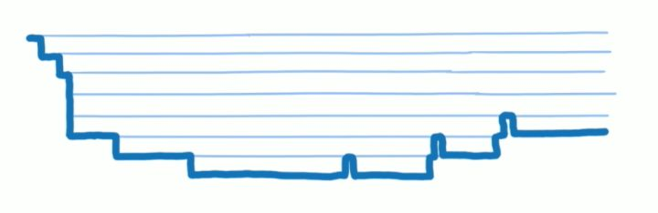
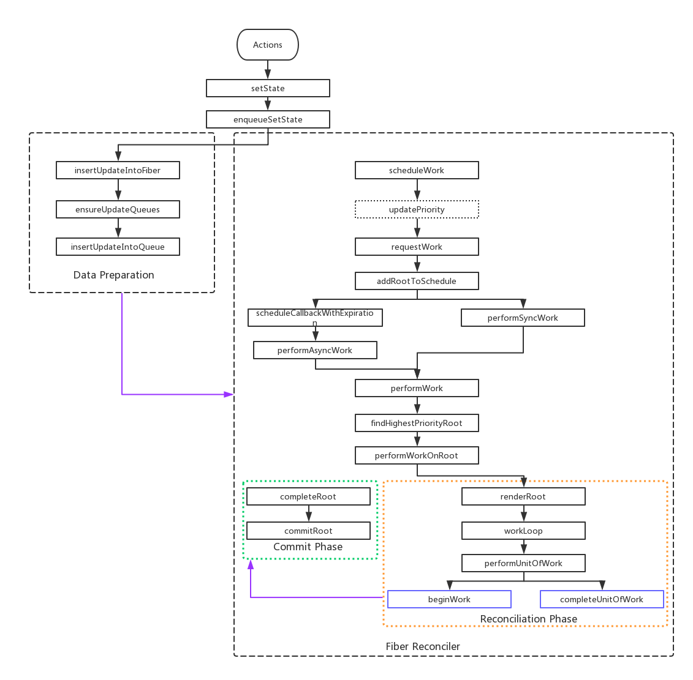

> 本文的demo仓库在https://github.com/qiqingjin/blog/tree/master/React_Redux/demos，喜欢请star哟~

# 为什么要重写React

## React16 以前
React16 以前，对virtural dom的更新和渲染是同步的。就是当一次更新或者一次加载开始以后，diff virtual dom并且渲染的过程是一口气完成的。如果组件层级比较深，相应的堆栈也会很深，长时间占用浏览器主线程，一些类似用户输入、鼠标滚动等操作得不到响应。借Lin的两张图，视频 [A Cartoon Intro to Fiber - React Conf 2017](https://www.youtube.com/watch?v=ZCuYPiUIONs)。



## React16 Fiber Reconciler
React16 用了分片的方式解决上面的问题。
就是把一个任务分成很多小片，当分配给这个小片的时间用尽的时候，就检查任务列表中有没有新的、优先级更高的任务，有就做这个新任务，没有就继续做原来的任务。这种方式被叫做异步渲染(Async Rendering)。


# Fiber 对开发者有什么影响

目前看有以下：

* `componentWillMount ` `componentWillReceiveProps`  `componentWillUpdate` 几个生命周期方法不再安全，由于任务执行过程可以被打断，这几个生命周期可能会执行多次，如果它们包含副作用（比如AJax），会有意想不到的bug。React团队提供了[替换的生命周期方法](https://reactjs.org/blog/2018/03/27/update-on-async-rendering.html)。建议如果使用以上方法，尽量用纯函数，避免以后采坑。
* 需要关注下react为任务片设置的优先级，特别是页面用动画的情况

# 如何试用Fiber异步渲染
默认情况下，异步渲染没有打开，如果你想试用，可以：
```js
import React from 'react';
import ReactDOM from 'react-dom';
import App from 'components/App';

const AsyncMode = React.unstable_AsyncMode;
const createApp = (store) => (
      <AsyncMode>
        <App store={store} />
      </AsyncMode>
);

export default createApp;
```

代码将开启严格模式和异步模式，React16不建议试用的API会在控制台有错误提示，比如`componentWillMount`。

# Fiber如何工作

## 一些原理

懂了原理看代码就简单点。

首先，Fiber是什么：
> A Fiber is work on a Component that needs to be done or was done. There can be more than one per component.

Fiber就是通过对象记录组件上需要做或者已经完成的更新，一个组件可以对应多个Fiber。

在render函数中创建的React Element树在第一次渲染的时候会创建一颗结构一模一样的Fiber节点树。不同的React Element类型对应不同的Fiber节点类型。一个React Element的工作就由它对应的Fiber节点来负责。

一个React Element可以对应不止一个Fiber，因为Fiber在update的时候，会从原来的Fiber（我们称为current）clone出一个新的Fiber（我们称为alternate）。两个Fiber diff出的变化（side effect）记录在alternate上。所以一个组件在更新时最多会有两个Fiber与其对应，在更新结束后alternate会取代之前的current的成为新的current节点。

其次，Fiber的基本规则：
更新任务分成两个阶段，Reconciliation Phase和Commit Phase。Reconciliation Phase的任务干的事情是，找出要做的更新工作（Diff Fiber Tree），就是一个计算阶段，计算结果可以被缓存，也就可以被打断；Commmit Phase 需要提交所有更新并渲染，为了防止页面抖动，被设置为不能被打断。

PS: `componentWillMount ` `componentWillReceiveProps`  `componentWillUpdate` 几个生命周期方法，在Reconciliation Phase被调用，有被打断的可能（时间用尽等情况），所以可能被多次调用。其实 `shouldComponentUpdate` 也可能被多次调用，只是它只返回`true`或者`false`，没有副作用，可以暂时忽略。

## 一些数据结构
>下面这些数据结构，可以在[源码中查看](https://github.com/facebook/react/tree/v16.3.2/packages/react-reconciler/src)。

* `fiber`是个链表，有`child`和`sibing`属性，指向第一个子节点和相邻的兄弟节点，从而构成fiber tree。`return`属性指向其父节点。[详见源码](https://github.com/facebook/react/blob/v16.3.2/packages/react-reconciler/src/ReactFiber.js#L68)。
* 更新队列，`updateQueue`，是一个链表，有`first`和`last`两个属性，指向第一个和最后一个`update`对象。[详见源码](https://github.com/facebook/react/blob/v16.3.2/packages/react-reconciler/src/ReactFiberUpdateQueue.js#L49)。
* 每个fiber有一个属性`updateQueue`指向其对应的更新队列。
* 每个fiber（当前fiber可以称为`current`）有一个属性`alternate`，开始时指向一个自己的clone体，`update`的变化会先更新到`alternate`上，当更新完毕，`alternate`替换`current`。

fiber tree的结构如下图（[引自博客](http://www.ayqy.net/blog/dive-into-react-fiber/#articleHeader4)）：


## 走进源码

**敲黑板，本文重点**

不要去github看源码，目录结构是真的复杂。可以自己写个React16的demo或者直接clone[我的demo](https://github.com/qiqingjin/blog/tree/master/React_Redux)，使用webpack develop mode，来debug `node_modules`中的`react.development.js`和`react-dom.development.js`。

更新入口肯定是setState方法，下面是我画的Fiber的调用关系图，比较简化，没有画判断条件。请注意，该图**基于 React v16.3.2** ，后面源码可能改动，注意时效性。



1. 用户操作引起`setState`被调用以后，先调用`enqueueSetState`方法，该方法可以划分成两个阶段（非官方说法，是我个人观点），第一阶段Data Preparation，是初始化一些数据结构，比如`fiber`,   `updateQueue`, `update`。
2. 新的`update`会通过`insertUpdateIntoQueue`方法，根据优先级插入到队列的对应位置，`ensureUpdateQueues`方法初始化两个更新队列，`queue1`和`current.updateQueue`对应，`queue2`和`current.alternate.updateQueue`对应。
3. 第二阶段，Fiber Reconciler，就开始进行任务分片调度，`scheduleWork`首先更新每个fiber的优先级，这里并没有`updatePriority`这个方法，但是干了这件事，我用虚线框表示。当`fiber.return === null`，找到父节点，把所有diff出的变化（side effect）归结到`root`上。
4. `requestWork`，首先把当前的更新添加到schedule list中（`addRootToSchedule`），然后根据当前是否为异步渲染（`isAsync`参数），异步渲染调用。`scheduleCallbackWithExpriation` 方法，下一步**高能**
5. `scheduleCallbackWithExpriation`这个方法在不同环境，实现不一样，chrome等览器中使用`requestIdleCallback` API，没有这个API的浏览器中，通过`requestAnimationFrame`模拟一个`requestIdleCallback`，来在浏览器空闲时，完成下一个分片的工作，注意，这个函数会传入一个`expirationTime`，超过这个时间活没干完，就放弃了。
6. 执行到`performWorkOnRoot`，就是fiber文档中提到的Commit Phase和Reconciliation Phase两阶段（官方说法）。
7. 第一阶段Reconciliation Phase，在`workLoop`中，通过一个`while`循环，完成每个分片任务。
8. `performUnitOfWork`也可以分成两阶段，蓝色框表示。`beginWork`是一个入口函数，根据`workInProgress`的类型去实例化不同的react element class。`workInProgress`是通过`alternate`挂载一些新属性获得的。
9. 实例化不同的react element class时候会调用和will有关的生命周期方法。
10. `completeUnitOfWork`是进行一些收尾工作，diff完一个节点以后，更新props和调用生命周期方法等。
11. 然后进入Commit Phase阶段，这个阶段不能被打断，不再赘述。

## 任务如何分片及分片的优先级

任务分片，或者叫工作单元(work unit)，是怎么拆分的呢。因为在Reconciliation Phase任务分片可以被打断，如何拆分一个任务就很重要了。React16中按照fiber进行拆分，也就是原来的虚拟dom节点。记不记得，开篇我们说到，初始化时候，一个虚拟dom树对应着一个结构一样的fiber tree，只是两个树的节点带的信息有差异。

那么这些任务分片的优先级如何呢？

React v16.0.0的优先级是这样划分的：
```js
{
  NoWork: 0, // No work is pending.
  SynchronousPriority: 1, // For controlled text inputs. Synchronous side-effects.
  TaskPriority: 2, // Completes at the end of the current tick.
  HighPriority: 3, // Interaction that needs to complete pretty soon to feel responsive.
  LowPriority: 4, // Data fetching, or result from updating stores.
  OffscreenPriority: 5, // Won't be visible but do the work in case it becomes visible.
}
```

可以把Priority分为同步和异步两个类别，同步优先级的任务会在当前帧完成，包括`SynchronousPriority`和`TaskPriority`。异步优先级的任务则可能在接下来的几个帧中被完成，包括`HighPriority`、`LowPriority`以及`OffscreenPriority`。

**React v16.3.2**的优先级，不再这么划分，分为三类：`NoWork`、`sync`、`async`，前两类可以认为是同步任务，需要在当前tick完成，过期时间为`null`，最后一类异步任务会计算一个`expirationTime`，在`workLoop`中，根据过期时间来判断是否进行下一个分片任务，`scheduleWork`中更新任务优先级，也就是更新这个`expirationTime`。至于这个时间怎么计算，可以[查看源码](https://github.com/facebook/react/blob/v16.3.2/packages/react-reconciler/src/ReactFiberExpirationTime.js)。

## 我的一个疑问

既然是每完成一个任务分片，就看看剩余时间是否够用，不够用就停止，让出主线程，够用就更新任务分片优先级并继续下一个高优先级任务分片，且任务分片的结果是可以被缓存的，为什么与`will`有关的三个生命周期函数会被多次执行？ 一个任务分片要么就是被完成、要么就是没有被完成，怎么会多次被执行？

从源码看，原因是异步渲染时候，会调用`requestIdleCallback` API，在回调函数中可以获得当前`callback`参数（也就是fiber的分片任务）还能执行多久，如果时间不够，分片任务会被打断（使用`cancelIdleCallback` API），下次就只能空闲时重新执行。[可以参考](http://www.zhangyunling.com/702.html)。

源码中，处理这个逻辑的函数`scheduleCallbackWithExpiration`:
```js
// cancelDeferredCallback在chrome等浏览器中就是cancelIdleCallback，没有实现这个API的浏览器，React会用requestAnimationFrame模拟一个该函数
// scheduleDeferredCallback同理，chrome等浏览器中是requestIdleCallback
function scheduleCallbackWithExpiration(expirationTime) {
    if (callbackExpirationTime !== NoWork) {
      // A callback is already scheduled. Check its expiration time (timeout).
      if (expirationTime > callbackExpirationTime) {
        // Existing callback has sufficient timeout. Exit.
        return;
      } else {
        // Existing callback has insufficient timeout. Cancel and schedule a
        // new one.
        cancelDeferredCallback(callbackID);
      }
      // The request callback timer is already running. Don't start a new one.
    } else {
      startRequestCallbackTimer();
    }

    // Compute a timeout for the given expiration time.
    var currentMs = now() - originalStartTimeMs;
    var expirationMs = expirationTimeToMs(expirationTime);
    var timeout = expirationMs - currentMs;

    callbackExpirationTime = expirationTime;
    callbackID = scheduleDeferredCallback(performAsyncWork, { timeout: timeout });
  }
```


# 最后

现在有关React Fiber，在v16.3.2版本下的运行，相关博客比较少，v16.0.0源码与v16.3.2有一些差异。个人能力有限，如果你有新的看法，欢迎评论。